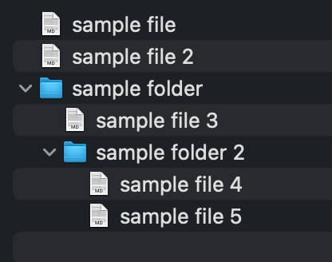

# File System Problem

**Complexity**: Mid-Senior  
**Time**: up to 30 minutes  
**Areas of expertise**: React, Basic JavaScript/TypeScript, basic CSS, time complexity, hash maps, JSON  

You are given a JSON file called FileSystem.json containing an array of files and folders.  
*Each object of said array has a field called name, parentName and a boolean property called isFile.* - this is a simplification of the task, could be removed for more experienced candidates.  
Your task is to recreate the UI of a file system hierarchy, like seen on the screenshot below.  
Each folder can be expanded to view the files or folders inside.  
The UI may not be a direct copy of the screenshot, however, it must retain the same functionality.  

### Further complications:
- Introduce different icons based on the file extension
- Write tests
- Make a validation to disallow special characters in file/folder naming
- Add previews for images instead of the default icon
- Drag-and-drop functionality that would alter the JSON file
- Search Functionality

### Solution fundamentals:
- Use a custom hook to parse the JSON file and output the file system structure
- Use a recursive function to render the file system structure
- Use a hash map to store the file system structure
- Add a padding to the left of the file/folder name based on the depth of the file/folder in the hierarchy